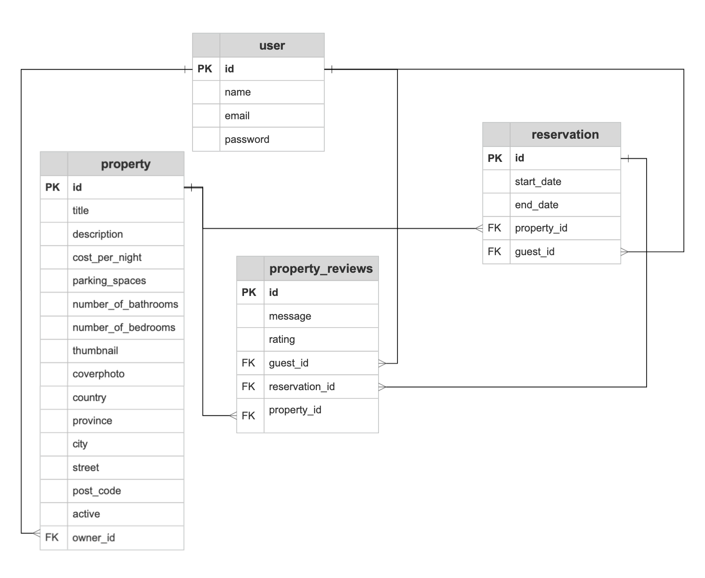
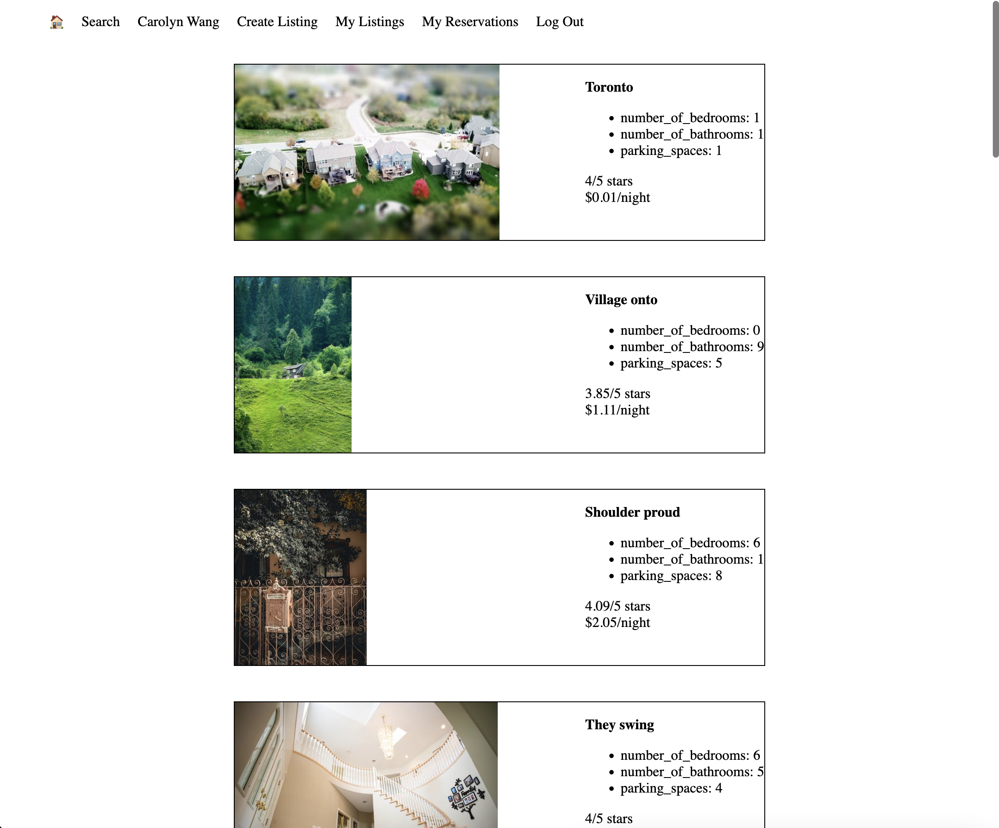
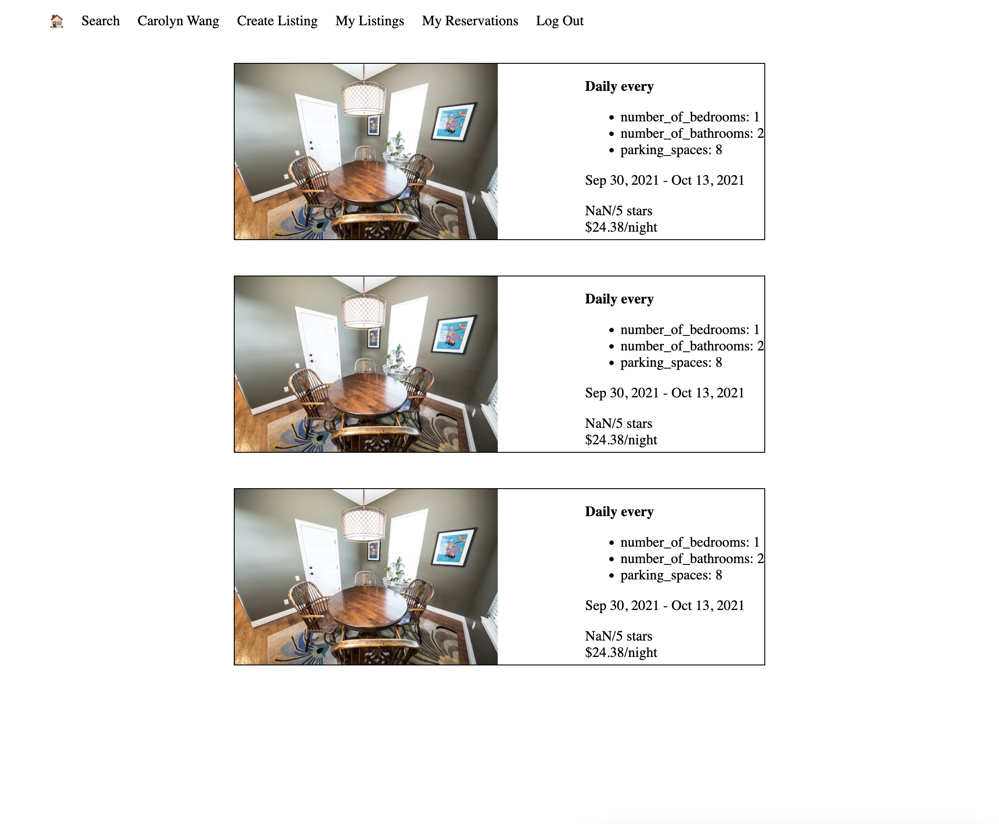

# LightBnB
The purpose of this project is to design a database and use server-side JavaScript to display the information from queries to web pages. This uses SQL queries, database and ERD (entity relationship diagram) design to integrate the database with a Node backend using PG.

Lighthouse BnB is an app that will revolutionize the travel industry. It will allow homeowners to rent out their homes to people on vacation, creating an alternative to hotels and bed and breakfasts...There’s nothing else like it! Users can view property information, book reservations, view their reservations, and write reviews. We'll be creating the first ever application to do something like this and we will call it LighthouseBnB.

# Running app
## Initializing DB

- Create a database called `lightbnb` from the psql terminal `CREATE DATABASE lightbnb`

- Build the database table from `\i migrations/01_schema.sql` from the root folder

- Seed data using files from `/seeds` in psql using `\i seeds/01_seeds.sql` and `\i seeds/02_seeds.sql` from the root folder

## Start server
- Install dependancies `npm i`
- Navigate to the `LightBnB_WebApp-master` folder and run the app `npm run local` 
- View it at `localhost:3000`.

# ERD

# Screenshots
### Listings

### My Reservations

# Dependancies
- bcrypt: 3.0.6
- cookie-session: 1.3.3
- express: 4.17.1
- nodemon: 1.19.1
- pg: 8.10.0
